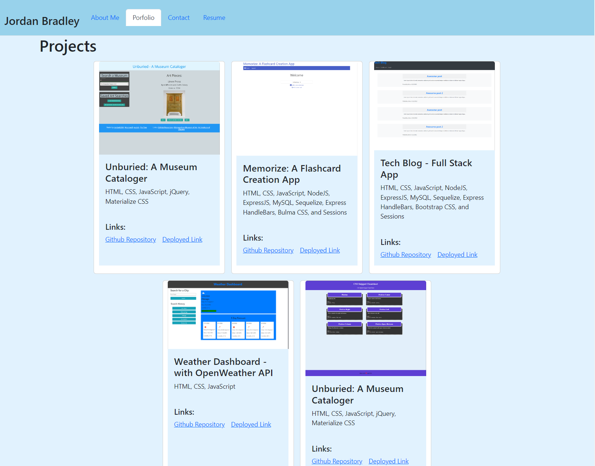

# awesome-portfolio-page

Awesome portfolio page made using React

## Description

This is my portfolio page showcasing my web development projects, information about me, contact info, and my resume and skills for review. This portfolio is made using ReactJS. When the user views my portfolio there is an About Me section, a Portfolio section, a Contact section, and a Resume section.

## Screenshot(s)

## Link to deployed page

[Link to deployed page](https://jordanb366.github.io/awesome-portfolio-page/)
